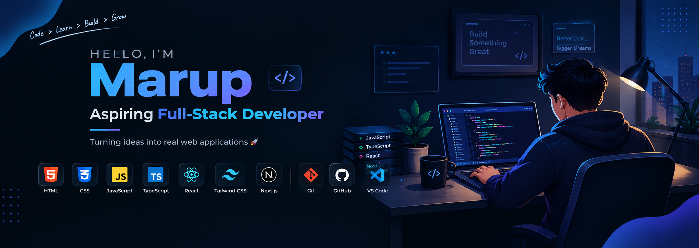

  

  

<h2>👨‍💻 About Me</h2>

<ul>
  <li>👋 I'm <strong>Marup</strong>, an aspiring Full-Stack Developer.</li>
  <li>💻 Currently learning <strong>Web Development</strong>.</li>
  <li>🌱 Learning <strong>JavaScript, TypeScript, React, Next.js & Tailwind CSS</strong>.</li>
  <li>🚀 Building modern and responsive web applications.</li>
  <li>📚 Next, I'll explore <strong>Backend, Authentication & MongoDB</strong>.</li>
  <li>🎯 Goal: Become a professional <strong>Full-Stack Developer</strong>.</li>
</ul>
<h2>🛠️ Technologies & Tools</h2>

<h3>💻 Languages</h3>

  

<h3>🎨 CSS Frameworks & Libraries</h3>

  

<h3>⚛️ JavaScript Frameworks & Libraries</h3>

  

<h3>🎨 Design & Graphics</h3>

  

<h3>🔧 Tools & Technologies</h3>

  

<h2>📊 GitHub Statistics</h2>

  

  

  

